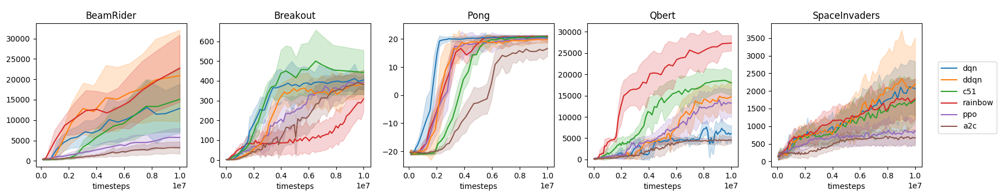
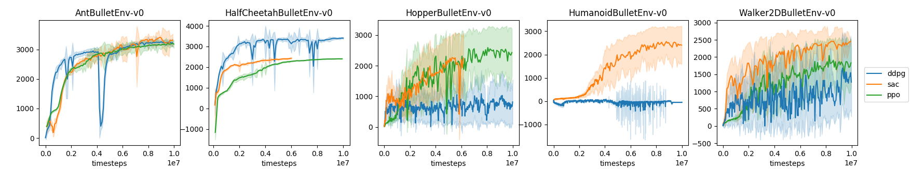

# The Autonomous Learning Library: A PyTorch Library for Building Reinforcement Learning Agents

The `autonomous-learning-library` is an object-oriented deep reinforcement learning (DRL) library for PyTorch.
The goal of the library is to provide the necessary components for quickly building and evaluating novel reinforcement learning agents,
as well as providing high-quality reference implementations of modern DRL algorithms.
The full documentation can be found at the following URL: [https://autonomous-learning-library.readthedocs.io](https://autonomous-learning-library.readthedocs.io).

## Tools for Building New Agents

The primary goal of the `autonomous-learning-library` is to facilitate the rapid development of new reinforcement learning agents by providing common tools for building and evaluation agents, such as:

* A flexible function `Approximation` API that integrates features such as target networks, gradient clipping, learning rate schedules, model checkpointing, multi-headed networks, loss scaling, logging, and more.
* Various memory buffers, including prioritized experience replay (PER), generalized advantage estimation (GAE), and more.
* A `torch`-based `Environment` interface that simplies agent implementations by cutting out the `numpy` middleman.
* Common wrappers and agent enhancements for replicating standard benchmarks.
* [Slurm](https://slurm.schedmd.com/documentation.html) integration for running large-scale experiments.
* Plotting and logging utilities including `tensorboard` integration and utilities for generating common plots.

See the [documentation](https://autonomous-learning-library.readthedocs.io) guide for a full description of the functionality provided by the `autonomous-learning-library`.
Additionally, we provide an [example project](https://github.com/cpnota/all-example-project) which demonstrates the best practices for building new agents.

## High-Quality Reference Implementations

The `autonomous-learning-library` separates reinforcement learning agents into two modules: `all.agents`, which provides flexible, high-level implementations of many common algorithms which can be adapted to new problems and environments, and `all.presets` which provides specific instansiations of these agents tuned for particular sets of environments, including Atari games, classic control tasks, and PyBullet robotics simulations. Some benchmark results showing results on-par with published results can be found below:




As of today, `all` contains implementations of the following deep RL algorithms:

- [x] Advantage Actor-Critic (A2C)
- [x] Categorical DQN (C51)
- [x] Deep Deterministic Policy Gradient (DDPG)
- [x] Deep Q-Learning (DQN) + extensions
- [x] Proximal Policy Optimization (PPO)
- [x] Rainbow (Rainbow)
- [x] Soft Actor-Critic (SAC)

It also contains implementations of the following "vanilla" agents, which provide useful baselines and perform better than you may expect:

- [x] Vanilla Actor-Critic
- [x] Vanilla Policy Gradient
- [x] Vanilla Q-Learning
- [x] Vanilla Sarsa

## Installation

First, you will need a new version of [PyTorch](https://pytorch.org) (>1.3), as well as [Tensorboard](https://pypi.org/project/tensorboard/).
Then, you can install the `autonomous-learning-library` through PyPi:

```
pip install autonomous-learning-library
```

Alternately, you can install directly from this repository:

```
git clone https://github.com/cpnota/autonomous-learning-library.git
cd autonomous-learning-library
pip install -e .
```

You can also install the prerequisites using:

```
pip install autonomous-learning-library[pytorch]
```

## Running the Presets

If you just want to test out some cool agents, the library includes several scripts for doing so:

```
all-atari Breakout a2c
```

You can watch the training progress using:

```
tensorboard --logdir runs
```

and opening your browser to http://localhost:6006.
Once the model is trained to your satisfaction, you can watch the trained model play using:

```
all-watch-atari Breakout "runs/_a2c [id]"
```

where `id` is the ID of your particular run. You should should be able to find it using tab completion or by looking in the `runs` directory.
The `autonomous-learning-library` also contains presets and scripts for classic control and PyBullet environments.

If you want to test out your own agents, you will need to define your own scripts.
Some examples can be found in the `examples` folder).
See the [docs](https://autonomous-learning-library.readthedocs.io) for information on building your own agents!

## Note

This library was built in the [Autonomous Learning Laboratory](http://all.cs.umass.edu) (ALL) at the [University of Massachusetts, Amherst](https://www.umass.edu).
It was written and is currently maintained by Chris Nota (@cpnota).
The views expressed or implied in this repository do not necessarily reflect the views of the ALL.

## Citing the Autonomous Learning Library

We recommend the following citation:

```
@misc{nota2020autonomous,
  author = {Nota, Chris},
  title = {The Autonomous Learning Library},
  year = {2020},
  publisher = {GitHub},
  journal = {GitHub repository},
  howpublished = {\url{https://github.com/cpnota/autonomous-learning-library}},
}
```
