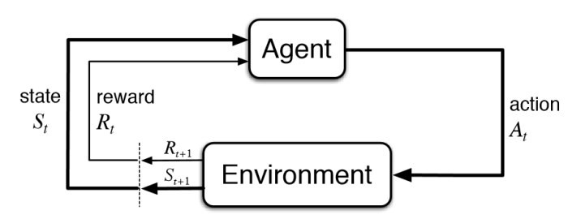
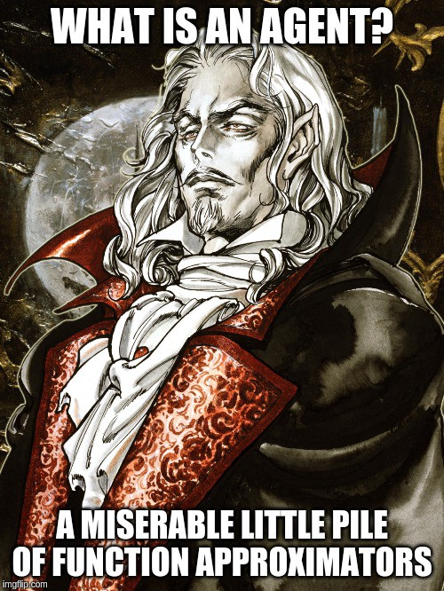
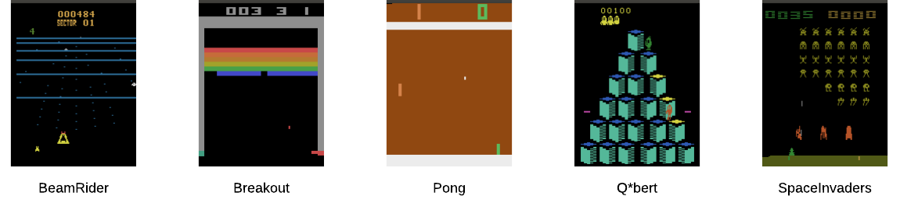

Basic Concepts
==============

In this section, we explain the basic elements of the ``autonomous-learning-library`` and the philosophy behind some of the basic design decision.

Agent-Based Design
------------------

One of the core philosophies in the autonomous-learning-library is that RL should be agent-based, not algorithm-based.
To see what we mean by this, check out the OpenAI Baselines implementation of DQN.
There's a giant function called ``learn`` which accepts an environment and a bunch of hyperparameters, at the heart of which there is a control loop which calls many different functions.
Which part of this function is the agent? Which part is the environment? Which part is something else?
We call this implementation algorithm-based because the central abstraction is a function called ``learn`` which provides the complete specification of an algorithm.
What should the proper abstraction for agent be, then? We have to look no further than the following famous diagram from the Sutton and Barto textbook:

The definition of an ``Agent`` is simple.
It accepts a state and reward, and returns an action.
That's it.
Everything else is an implementation detail.
Here's the ``Agent`` interface in the autonomous-learning-library:

.. code-block:: python

    class Agent(ABC):
        @abstractmethod
        def act(self, state):
            pass

The ``act`` function is called when training the agent.
When and how the ``Agent`` trains inside of this function is nobody's business except the ``Agent`` itself.
When the ``Agent`` is allowed to act is determined by some outer control loop, and is not of concern to the ``Agent``.
What might an implementation of ``act`` look like? Here's the act function from our DQN implementation:

.. code-block:: python

    def act(self, state):
        self.replay_buffer.store(self._state, self._action, state)
        self._train()
        self._state = state
        self._action = self.policy.no_grad(state)
        return self._action

That's it. ``_train()`` is a private helper methods.
There is no reason for the control loop to know anything about these details.
There is no tight coupling between the ``Agent`` and the control loop.
This approach simplifies both our ``Agent`` implementation and the control loop itself.

Separating the control loop logic from the ``Agent`` logic allows greater flexibility in the way agents are used.
In fact, ``Agent`` is entirely decoupled from the ``Environment`` interface.
This means that our agents can be used outside of standard research environments, such as part of a REST API, a multi-agent system, etc.
Any code that passes a ``State`` is compatible with our agents.

What is a ``State``?
The ``State`` abstraction is part of ``all.core`` and it represents all of the information available to the agent at a given timestep.
It contains some default entries, including ``state['observation']``, ``state['reward']``, and ``state['done']``, and ``state['mask']``.
A ``StateArray`` object can be constucted by calling ``State.array(list_of_states)``, and provides an abstraction for batch processing of states.
Arbitrary entries can be added to a ``State``, and use of the ``StateArray`` abstraction ensures that these entries are combined and sliced properly.
The code does not need to be tightly coupled to the shape of the data, but rather can act on the abstraction. 

Parallel Agents and Multiagents
-------------------------------

We described above the base ``Agent`` interface.
However, some algorithms do not fit this interface.
For example, a ``ParallelAgent`` accepts a ``StateArray`` rather than a ``State``.
A ``Multiagent`` accepts a ``State`` object containing a special ``Agent`` key indicating to which of the multiagents the current state belongs,
we we call a ``MultiagentState``.
Nevertheless, we stick to the spirit of having a single ``act()`` function as closely as possible.
The resulting interfaces are as follows:

.. code-block:: python

    class ParallelAgent(ABC):
        @abstractmethod
        def act(self, state_array):
            pass

    class Multiagent(ABC):
        @abstractmethod
        def act(self, multiagent_state):
            pass

Function Approximation
----------------------

Almost everything a deep reinforcement learning agent does is predicated on *function approximation*.

For this reason, one of the central abstractions in the ``autonomous-learning-library`` is ``Approximation``.
By building agents that rely on the ``Approximation`` abstraction rather than directly interfacing with PyTorch ``Module`` and ``Optimizer`` objects,
we can add to or modify the functionality of an ``Agent`` without altering its source code (this is known as the `Open-Closed Principle <https://en.wikipedia.org/wiki/Open–closed_principle>`_).
The default ``Approximation`` object allows us to achieve a high level of code reuse by encapsulating common functionality such as logging, model checkpointing, target networks, learning rate schedules and gradient clipping.
The ``Approximation`` object in turn relies on a set of abstractions that allow users to alter its behavior.
Let's look at a simple usage of ``Approximation`` in solving a very easy supervised learning task:

.. code-block:: python

    import torch
    from torch import nn, optim
    from all.approximation import Approximation

    # create a pytorch module
    model = nn.Linear(16, 1)

    # create an associated pytorch optimizer
    optimizer = optim.Adam(model.parameters(), lr=1e-2)

    # create the function approximator
    f = Approximation(model, optimizer)

    for _ in range(200):
        # Generate some arbitrary data.
        # We'll approximate a very simple function:
        # the sum of the input features.
        x = torch.randn((16, 16))
        y = x.sum(1, keepdim=True)

        # forward pass
        y_hat = f(x)

        # compute loss
        loss = nn.functional.mse_loss(y_hat, y)

        # backward pass
        f.reinforce(loss)

Easy! Now let's look at the _train() function for our DQN agent:

.. code-block:: python

    def _train(self):
        if self._should_train():
            # sample transitions from buffer
            (states, actions, rewards, next_states, _) = self.replay_buffer.sample(self.minibatch_size)

            # forward pass
            values = self.q(states, actions)

            # compute targets
            targets = rewards + self.discount_factor * torch.max(self.q.target(next_states), dim=1)[0]

            # compute loss
            loss = self.loss(values, targets)

            # backward pass
            self.q.reinforce(loss)

Just as easy!
The agent does not need to know anything about the network architecture, logging, regularization, etc.
These are all handled through the appropriate configuration of ``Approximation``.
Instead, the ``Agent`` implementation is able to focus exclusively on its sole purpose: defining the RL algorithm itself.
By encapsulating these details in ``Approximation``, we are able to follow the `single responsibility principle <https://en.wikipedia.org/wiki/Single_responsibility_principle>`_.

A few other quick things to note: ``f.no_grad(x)`` runs a forward pass with ``torch.no_grad()``, speeding computation.
``f.eval(x)`` does the same, but also puts the model in `eval` mode first, (e.g., ``BatchNorm`` or ``Dropout`` layers), and then puts the model back into its previous mode before returning. 
``f.target(x)`` calls the *target network* (an advanced concept used in algorithms such as DQN. For example, David Silver's `course notes <http://www0.cs.ucl.ac.uk/staff/d.silver/web/Talks_files/deep_rl.pdf>`_) associated with the ``Approximation``, also with ``torch.no_grad()``.
The ``autonomous-learning-library`` provides a few thin wrappers over ``Approximation`` for particular purposes, such as ``QNetwork``, ``VNetwork``, ``FeatureNetwork``, and several ``Policy`` implementations.

Environments
------------

The importance of the ``Environment`` in reinforcement learning nearly goes without saying.
In the ``autonomous-learning-library``, the prepackaged environments are simply wrappers for `OpenAI Gym <http://gym.openai.com>`_, the defacto standard library for RL environments.

    Some environments included in the Atari suite in Gym. This picture is just so you don't get bored.

We add a few additional features:

1) ``gym`` primarily uses ``numpy.array`` for representing states and actions. We automatically convert to and from ``torch.Tensor`` objects so that agent implemenetations need not consider the difference.
2) We add properties to the environment for ``state``, ``reward``, etc. This simplifies the control loop and is generally useful.
3) We apply common preprocessors, such as several standard Atari wrappers. However, where possible, we prefer to perform preprocessing using ``Body`` objects to maximize the flexibility of the agents.

Below, we show how several different types of environments can be created:

.. code-block:: python

    from all.environments import AtariEnvironment, GymEnvironment, PybulletEnvironment

    # create an Atari environment on the gpu
    env = AtariEnvironment('Breakout', device='cuda')

    # create a classic control environment on the cpu
    env = GymEnvironment('CartPole-v0')

    # create a PyBullet environment on the cpu
    env = PybulletEnvironment('cheetah')

Now we can write our first control loop:

.. code-block:: python

    # initialize the environment
    env.reset()

    # Loop for some arbitrary number of timesteps.
    for timesteps in range(1000000):
        env.render()
        action = agent.act(env.state)
        env.step(action)

        if env.done:
            # terminal update
            agent.act(env.state)

            # reset the environment
            env.reset()

Of course, this control loop is not exactly feature-packed.
Generally, it's better to use the ``Experiment`` module described later.

Presets
-------

In the ``autonomous-learning-library``, agents are *compositional*, which means that the behavior of a given ``Agent`` depends on the behavior of several other objects.
Users can compose agents with specific behavior by passing appropriate objects into the constructor of the high-level algorithms contained in ``all.agents``.
The library provides a number of functions which compose these objects in specific ways such that they are appropriate for a given set of environment.
We call such a function a ``preset``, and several such presets are contained in the ``all.presets`` package.
(This is an example of the more general `factory method pattern <https://en.wikipedia.org/wiki/Factory_method_pattern>`_).

For example, ``all.agents.dqn`` contains a high-level description of the DQN algorithm.
However, how do we actually instansiate a particular network architecture, choose a learning rate, etc.?
This is what presets are for.
Before we dive into the details, let us show the simplest usage in practice:

.. code-block:: python

    from all.presets.atari import dqn
    from all.environments import AtariEnvironment
    
    # create an environment
    env = AtariEnvironment('Breakout')

    # configure and build the preset
    preset = dqn.env(env).build()

    # use the preset to create an agent
    agent = preset.agent()

Instansiating the Agent is separated into two steps:
First we configure and build the ``Preset``, then we use the configured ``Preset`` to instansiate an ``Agent``.
Let's dig into the ``Preset`` interface first:

.. code-block:: python

    class Preset(ABC):
        @abstractmethod
        def agent(self, logger=None, train_steps=float('inf')):
            pass

        @abstractmethod
        def test_agent(self):
            pass

        def save(self, filename):
            return torch.save(self, filename)

The ``agent()`` method instansiates a training ``Agent``.
The ``test_agent()`` method instansiates a test-mode ``Agent`` using the same network parameters as the training ``Agent``.
The ``save()`` then allows the ``Preset`` to be saved to a disk.
Critically, all agents created by a given instance of a ``Preset`` share the underlying network parameters.
The test agents, however, will instead copy the parameters, allowing test agents to be compared from multiple points in training.
If a ``Preset`` is loaded from disk, then we can instansiate a test ``Agent`` using the pre-trained parameters.

Experiment
----------

Finally, we have all of the components necessary to introduce the ``run_experiment`` helper function.
``run_experiment`` is the built-in control loop for running reinforcement learning experiment.
It instansiates its own ``Logger`` object for logging, which is then passed to each of the presets, and runs each agent on each environment passed to it for some number of timesteps (frames) or episodes).
Here is a quick example:

.. code-block:: python

    from gym import envs
    from all.experiments import run_experiment
    from all.presets import atari
    from all.environments import AtariEnvironment

    agents = [
        atari.dqn,
        atari.ddqn,
        atari.c51,
        atari.rainbow,
        atari.a2c,
        atari.ppo,
    ]

    envs = [AtariEnvironment(env, device='cuda') for env in ['BeamRider', 'Breakout', 'Pong', 'Qbert', 'SpaceInvaders']]

    run_experiment(agents, envs, 10e6)

The above block executes each run sequentially.
This could take a very long time, even on a fast GPU!
If you have access to a cluster running Slurm, you can replace ``run_experiment`` with ``SlurmExperiment`` to speed things up substantially (the magic of submitting jobs is handled behind the scenes).

By default, ``run_experiment`` will write the results to ``./runs``.
You can view the results in ``tensorboard`` by running the following command:

.. code-block:: bash

    tensorboard --logdir runs

In addition to the ``tensorboard`` logs, every 100 episodes, the mean and standard deviation of the previous 100 episode returns are written to ``runs/[agent]/[env]/returns100.csv``.
This is much faster to read and plot than Tensorboard's proprietary format.
The library contains an automatically plotting utility that generates appropriate plots for an *entire* ``runs`` directory as follows:

.. code-block:: python

    from all.experiments import plot_returns_100
    plot_returns_100('./runs')

This will generate a plot that looks like the following (after tweaking the whitespace through the ``matplotlib`` UI):

.. image:: ../../../benchmarks/atari40.png

An optional parameter is ``test_episodes``, which is set to 100 by default.
After running for the given number of frames, the agent will be evaluated for a number of episodes specified by ``test_episodes`` with training disabled.
This is useful measuring the final performance of an agent.

You can also pass optional parameters to ``run_experiment`` to change its behavior.
You can set ``render=True`` to watch the agent during training (generally not recommended: it slows the agent considerably!).
You can set ``quiet=True`` to silence command line output.
Lastly, you can set ``verbose=False`` to disable writing loss and debugging information to ``tensorboard``.
These files can become large, so this is recommended if you have limited storage!

Finally, ``run_experiment`` relies on an underlying ``Experiment`` API.
If you don't like the behavior of ``run_experiment``, you can reuse the underlying ``Experiment`` objects to change it.
