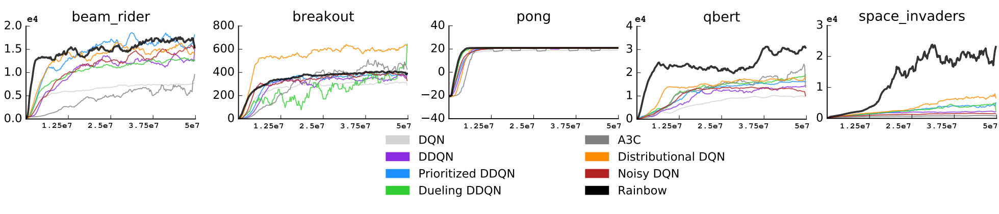

Benchmark Performance
=====================

Reinforcement learning algorithms are difficult to debug and test.
For this reason, in order to ensuring the correctness of the preset agents provided by the ``autonomous-learning-library``,
we benchmark each algorithm after every major change.
We also discuss the performance of our implementations relative to published results.
For our hyperparameters for each domain, see :ref:`all.presets`.

Atari Benchmark
---------------

To benchmark the ``all.presets.atari`` presets, we ran each agent for 10 million timesteps (40 million in-game frames).
The learning rate was decayed over the course of training using cosine annealing.
The environment implementation uses the following wrappers:

* NoopResetEnv (adds a random number of noops at the beginning of each game reset)
* MaxAndSkipEnv (Repeats each action four times before the next agent observation. Takes the max pixel value over the four frames.)
* FireResetEnv (Automatically chooses the "FIRE" action when env.reset() is called)
* WarpFrame (Rescales the frame to 84x84 and greyscales the image)
* LifeLostEnv (Adds a key to "info" indicating that a life was lost)

Additionally, we use the following agent "bodies":

* FrameStack (provides the last four frames as the state)
* ClipRewards (Converts all rewards to {-1, 0, 1})
* EpisodicLives (If life was lost, treats the frame as the end of an episode)

The results were as follows:

.. image:: ../../../benchmarks/atari40.png

For comparison, we look at the results published in the paper, `Rainbow: Combining Improvements in Deep Reinforcement Learning <https://arxiv.org/abs/1710.02298>`_:

In these results, the authors ran each agent for 50 million timesteps (200 million frames).
We can see that at the 10 million timestep mark, our results are similar or slightly better.
Our ``dqn`` and ``ddqn`` in particular were better almost across the board.
While there are some minor implementation differences (for example, we use ``Adam`` for most algorithms instead of ``RMSprop``),
our agents achieved very similar behavior to the agents tested by DeepMind.

PyBullet Benchmark
------------------

`PyBullet <https://pybullet.org/wordpress/>`_ provides a free alternative to the popular MuJoCo robotics environments.
While MuJoCo requires a license key and can be difficult for independent researchers to afford, PyBullet is free and open.
Additionally, the PyBullet environments are widely considered more challenging, making them a more discriminant test bed.
For these reasons, we chose to benchmark the ``all.presets.continuous`` presets using PyBullet.

Similar to the Atari benchmark, we ran each agent for 10 million timesteps (in this case, timesteps are equal to frames).
The learning rate was decayed over the course of training using cosine annealing.
To reduce the variance of the updates, we added an extra time feature to the state (t * 0.001, where t is the current timestep).
The results were as follows:

.. image:: ../../../benchmarks/pybullet.png

PPO was omitted from the plot for Humanoid because it achieved very large negative returns which interfered with the scale of the graph.
Note, however, that our implementation of soft actor-critic (SAC) is able to solve even this difficult environment.

Because most research papers still use MuJoCo, direct comparisons are difficult to come by.
However, George Sung helpfully benchmarked TD3 and DDPG on several PyBullet environments [here](https://github.com/georgesung/TD3).
However, he only ran each environment for 1 million timesteps and tuned his hyperparameters accordingly.
Generally, our agents achieved higher final perfomance but converged more slowly.
