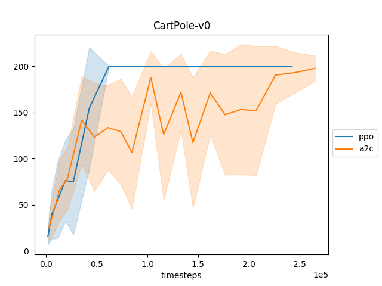

Getting Started
===============

Prerequisites
-------------

The Autonomous Learning Library requires a recent version of PyTorch (~=1.8.0 recommended).
Additionally, Tensorboard is required in order to enable logging.
We also strongly recommend using a machine with a fast GPU (at minimum a GTX 970 or better, a GTX 1080ti or better is preferred).

Installation
------------

The ``autonomous-learning-library`` can be installed from PyPi using ``pip``:

.. code-block:: bash

    pip install autonomous-learning-library

This will only install the core library.
If you want to install all included environments, run:

.. code-block:: bash

    pip install autonomous-learning-library[all]

You can also install only a subset of the enviornments.
For the list of optional dependencies, take a look at the `setup.py <https://github.com/cpnota/autonomous-learning-library/blob/master/setup.py>`_.

An alternate approach, that may be useful when following this tutorial, is to instead install by cloning the Github repository:

.. code-block:: bash

    git clone https://github.com/cpnota/autonomous-learning-library.git
    cd autonomous-learning-library
    pip install -e .[dev]

``dev`` will install all of the optional dependencies for developers of the repo, such as unit test and documentation dependencies, as well as all environments.
If you chose to clone the repository, you can test your installation by running the unit test suite:

.. code-block:: bash

    make test

This should also tell you if CUDA (the GPU driver) is available.

Running a Preset Agent
----------------------

The goal of the Autonomous Learning Library is to provide components for building new agents.
However, the library also includes a number of "preset" agent configurations for easy benchmarking and comparison,
as well as some useful scripts.
For example, a PPO agent can be run on Cart-Pole as follows:

.. code-block:: bash

    all-classic CartPole-v0 a2c

The results will be written to ``runs/a2c_<COMMIT>_<DATETIME>``, where ``<COMMIT>`` and ``<DATATIME>`` are strings generated by the library.
You can view these results and other information through `tensorboard`:

.. code-block:: bash

    tensorboard --logdir runs

By opening your browser to <http://localhost:6006>, you should see a dashboard that looks something like the following (you may need to adjust the "smoothing" parameter):

.. image:: tensorboard.png

If you want to compare agents in a nicer, format, you can use the `plot` script:

.. code-block:: bash

    all-plot --logdir runs

This should give you a plot similar to the following:

In this plot, each point represents the average of the episodic returns over the last 100 episodes for every 100 episodes.
The shaded region represents the standard deviation over that interval.

Finally, to watch the trained model in action, we provide a `watch` scripts for each preset module:

.. code-block:: bash

   all-watch-classic CartPole-v0 runs/a2c_<COMMIT>_<DATETIME>/preset.pt

You need to find the <id> by checking the ``runs`` directory.

Each of these scripts can be found the ``scripts`` directory of the main repository.
Be sure to check out the ``atari`` and ``continuous`` scripts for more fun!
