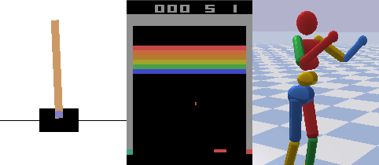

The Autonomous Learning Library
===============================

The `Autonomous Learning Library <https://github.com/cpnota/autonomous-learning-library>`_ is a PyTorch-based toolkit for building and evaluating reinforcement learning agents.

Here are some common links:

* The `GitHub <https://github.com/cpnota/autonomous-learning-library>`_ repository.
* The :ref:`Getting Started` guide.
* An `example project <https://github.com/cpnota/all-example-project>`_ to help you get started building your own agents.
* The :ref:`Benchmark Performance` for our preset agents.
* The :ref:`all.presets` documentation, including default hyperparameters.

Enjoy!

.. toctree::
    :maxdepth: 2
    :caption: User Guide:

    guide/getting_started
    guide/basic_concepts
    guide/creating_agent
    guide/benchmark_performance

.. toctree::
    :maxdepth: 4
    :caption: Modules:

    modules/agents
    modules/approximation
    modules/bodies
    modules/core
    modules/environments
    modules/experiments
    modules/logging
    modules/memory
    modules/nn
    modules/optim
    modules/policies
    modules/presets

Indices and tables
==================

* :ref:`genindex`
* :ref:`modindex`
* :ref:`search`
